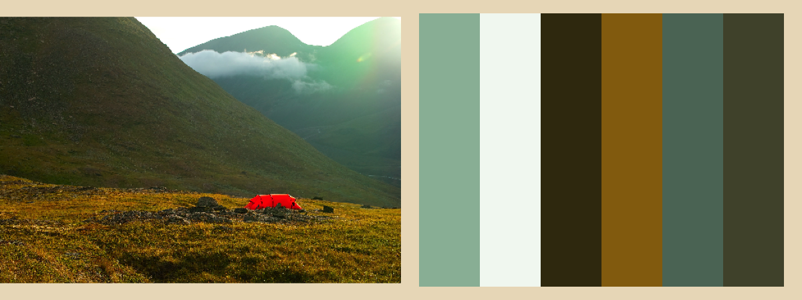
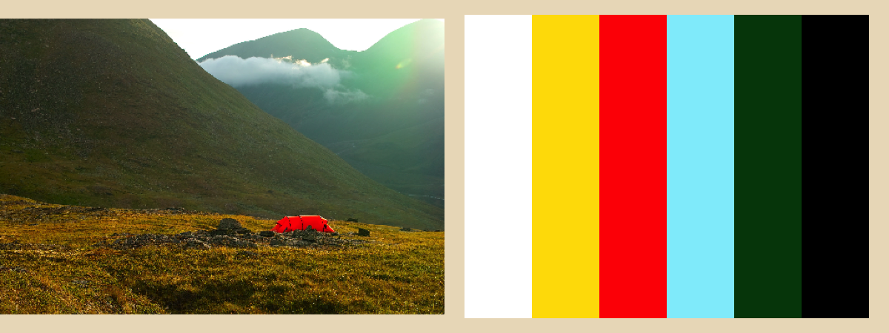

An R implementation of the palette extraction part of Tam, Echevarria and
Gingold's paper ”[Efficient palette-based decomposition and recoloring of
images via RGBXY-space geometry](https://cragl.cs.gmu.edu/fastlayers/)”
(2018).

Needs `glpk` and `qhull` installed locally, e.g.

```
brew install glpk
brew install qhull
```

### Examples
Extracting palettes using k-means often misses perceptually important colors:



Whereas `colorhull` includes these but might also produce additional colors
without much perceptual importance:



*[Photo by author.]*
